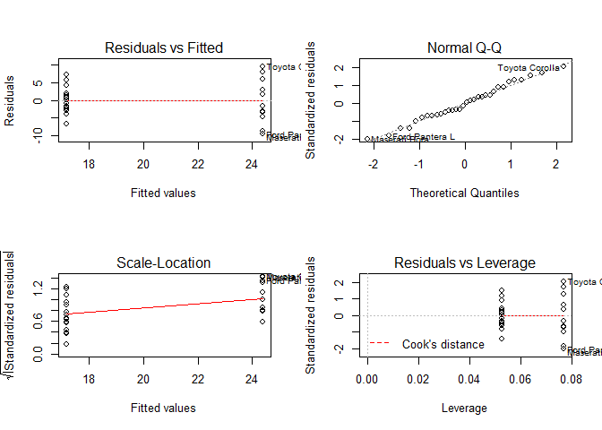

## Executive Summary

Motor Trend is the top automobile magazine in the United States for producing accurate automobile data to the public. Following is a data analysis which will answer one question and support the answer with quantifiable data.


1. Is an automatic or manual transmission better for MPG (miles per gallon)?
2. Quantify the MPG difference between automatic and manual transmissions.

The following analysis will show the answers are:

1. The automatic or manual tranmission as compared to MPG for this data set is not statistically significant.
2. The MPG difference is 1.8 for automatic transmission vs. manual tranmissions.

## Loading and Preprocessing the Data

A description of the data can be found at https://stat.ethz.ch/R-manual/R-patched/library/datasets/html/mtcars.html Let's get an idea of what the data within the data frame looks like.


```r
head(mtcars)
```

```
##                    mpg cyl disp  hp drat    wt  qsec vs am gear carb
## Mazda RX4         21.0   6  160 110 3.90 2.620 16.46  0  1    4    4
## Mazda RX4 Wag     21.0   6  160 110 3.90 2.875 17.02  0  1    4    4
## Datsun 710        22.8   4  108  93 3.85 2.320 18.61  1  1    4    1
## Hornet 4 Drive    21.4   6  258 110 3.08 3.215 19.44  1  0    3    1
## Hornet Sportabout 18.7   8  360 175 3.15 3.440 17.02  0  0    3    2
## Valiant           18.1   6  225 105 2.76 3.460 20.22  1  0    3    1
```
It is shown that there is a row for each make and model of automobile.

Let's look at the actual attributes of the data.


```r
data("mtcars")
str(mtcars)
```

```
## 'data.frame':	32 obs. of  11 variables:
##  $ mpg : num  21 21 22.8 21.4 18.7 18.1 14.3 24.4 22.8 19.2 ...
##  $ cyl : num  6 6 4 6 8 6 8 4 4 6 ...
##  $ disp: num  160 160 108 258 360 ...
##  $ hp  : num  110 110 93 110 175 105 245 62 95 123 ...
##  $ drat: num  3.9 3.9 3.85 3.08 3.15 2.76 3.21 3.69 3.92 3.92 ...
##  $ wt  : num  2.62 2.88 2.32 3.21 3.44 ...
##  $ qsec: num  16.5 17 18.6 19.4 17 ...
##  $ vs  : num  0 0 1 1 0 1 0 1 1 1 ...
##  $ am  : num  1 1 1 0 0 0 0 0 0 0 ...
##  $ gear: num  4 4 4 3 3 3 3 4 4 4 ...
##  $ carb: num  4 4 1 1 2 1 4 2 2 4 ...
```

We can now see that mtcars is a data.frame with 32 observations and 11 variables. All of the variables have a type of numbers.

## Data Cleansing

Since all of the variables are type of number and we need to use them for analysis, some variables need to be converted to factors so that they are not treated as numerics.


```r
mtcars$cyl <- as.factor(mtcars$cyl)
mtcars$vs <- as.factor(mtcars$vs)
mtcars$am <- as.factor(mtcars$am)
mtcars$gear <- as.factor(mtcars$gear)
mtcars$carb <- as.factor(mtcars$carb)
```

##Exploratory Analysis

Let's just begin with a simple linear regression of MPG vs automatic/manual transmissions. The assumptions are that the linear model is appropriate for the mean value of yi, and the error distribution should be normally distributed and independent.


```r
fit_linear <- lm(mpg ~ am, mtcars)
```

Refer to Figure 1 of the Appendix.


```r
summary(fit_linear)
```

```
## 
## Call:
## lm(formula = mpg ~ am, data = mtcars)
## 
## Residuals:
##     Min      1Q  Median      3Q     Max 
## -9.3923 -3.0923 -0.2974  3.2439  9.5077 
## 
## Coefficients:
##             Estimate Std. Error t value Pr(>|t|)    
## (Intercept)   17.147      1.125  15.247 1.13e-15 ***
## am1            7.245      1.764   4.106 0.000285 ***
## ---
## Signif. codes:  0 '***' 0.001 '**' 0.01 '*' 0.05 '.' 0.1 ' ' 1
## 
## Residual standard error: 4.902 on 30 degrees of freedom
## Multiple R-squared:  0.3598,	Adjusted R-squared:  0.3385 
## F-statistic: 16.86 on 1 and 30 DF,  p-value: 0.000285
```

Reviewing the coefficients from the summary data, we can look for the confidence interval using the formula betahat +/- t*SE(betahat).


```r
betahat <- .7245  
SE <- 1.764        
tstar <- qt(1-0.05/2, df = length(mtcars$mpg) - 2)
c(betahat - tstar*SE, betahat + tstar *SE)
```

```
## [1] -2.878069  4.327069
```

From both the plots in Figure one, the results of our coefficient summary, small p-value, and inclusion of 0 in the confidence internval, we reject the null hypothesis that tranmission affects MPG.

##Multivariate Analysis

While we are exploring MPG for manual vs automatic transmissions, we know that including new variables will increase standard errors of coefficient estimates of other correlated regressors. However, we need to be cautious not to omit variables because that will result in bias in coefficients of regressors which are correlated to the omitted variables.

First create a fit for all of the variables in reference to mpg.


```r
fit_all <- lm(mpg ~ . , mtcars)
```

Next, determine which variables are necessary for the correlation can be done by using the stepAIC function in R. Details can be found here: https://stat.ethz.ch/R-manual/R-devel/library/MASS/html/stepAIC.html


```r
library(MASS)
step <- stepAIC(fit_all, direction="both", trace=FALSE)
summary(step)
```

```
## 
## Call:
## lm(formula = mpg ~ cyl + hp + wt + am, data = mtcars)
## 
## Residuals:
##     Min      1Q  Median      3Q     Max 
## -3.9387 -1.2560 -0.4013  1.1253  5.0513 
## 
## Coefficients:
##             Estimate Std. Error t value Pr(>|t|)    
## (Intercept) 33.70832    2.60489  12.940 7.73e-13 ***
## cyl6        -3.03134    1.40728  -2.154  0.04068 *  
## cyl8        -2.16368    2.28425  -0.947  0.35225    
## hp          -0.03211    0.01369  -2.345  0.02693 *  
## wt          -2.49683    0.88559  -2.819  0.00908 ** 
## am1          1.80921    1.39630   1.296  0.20646    
## ---
## Signif. codes:  0 '***' 0.001 '**' 0.01 '*' 0.05 '.' 0.1 ' ' 1
## 
## Residual standard error: 2.41 on 26 degrees of freedom
## Multiple R-squared:  0.8659,	Adjusted R-squared:  0.8401 
## F-statistic: 33.57 on 5 and 26 DF,  p-value: 1.506e-10
```

According to this summary, the significant variables in relation to the mpg are cyl(cylinders), hp(horsepower) and wt(weight)

## Comparison of the two models.

To verify that the multivariate model from step is the better fit, use ANOVA to compare the two models.


```r
anova(fit_linear, step)
```

```
## Analysis of Variance Table
## 
## Model 1: mpg ~ am
## Model 2: mpg ~ cyl + hp + wt + am
##   Res.Df    RSS Df Sum of Sq      F    Pr(>F)    
## 1     30 720.90                                  
## 2     26 151.03  4    569.87 24.527 1.688e-08 ***
## ---
## Signif. codes:  0 '***' 0.001 '**' 0.01 '*' 0.05 '.' 0.1 ' ' 1
```

Upon comparing the two models, the diffence is significant, leading us to rule out the simpler model.

Visually, it may be easier to see if we plot this best fit model.
This is done in Figure 2 in the Appendix.

## Determining the Significance of the transmission type on mpg

Let's summarize the coeffients of this best model:


```r
coefficients(summary(step))
```

```
##                Estimate Std. Error   t value     Pr(>|t|)
## (Intercept) 33.70832390 2.60488618 12.940421 7.733392e-13
## cyl6        -3.03134449 1.40728351 -2.154040 4.068272e-02
## cyl8        -2.16367532 2.28425172 -0.947214 3.522509e-01
## hp          -0.03210943 0.01369257 -2.345025 2.693461e-02
## wt          -2.49682942 0.88558779 -2.819404 9.081408e-03
## am1          1.80921138 1.39630450  1.295714 2.064597e-01
```

Reviewing the p-values in the summary data, we can see that the p-value for am (automatic vs. manual transmission) is not significant in the measurement of mpg. This can be proven with the confidence interval formula as done previously in the Exploratory analysis section.


```r
betahat1 <- 1.80921138  #From the summary for am 
SE1 <- 1.39630450       #From the summary for am
tstar1 <- qt(1-0.05/2, df = length(mtcars$mpg) - 2)
c(betahat1 - tstar1*SE1, betahat1 + tstar1 *SE1)
```

```
## [1] -1.042423  4.660846
```

Since the confidence interval includes 0 and the p-value is greater than .05, the difference between an automatic tranmission and a manual transmission does not significantly impact mpg(miles per gallon). It does however show that an automatic tranmission is 1.8 greater than a manual transmission.

##Conclusion

Upon review of the the models, the best fit in Figure 2, it is shown that the Normal Q-Q graph is normally distributed and the Scale-Location graph has a a steady variance. This is improved from Figure 1 where only am(transmission type) was compared with mpg. Upon further review, it was determined that am did not have a significant impact on mpg.

##Graphical Representation
Linear Model:


```r
par(mfrow=c(2,2))
plot(fit_linear); 
abline(fit_linear)
```

<!-- -->

MultiVariate Model:


```r
par(mfrow=c(2,2))
plot(fit_linear); 
abline(fit_linear)
```

<!-- -->
